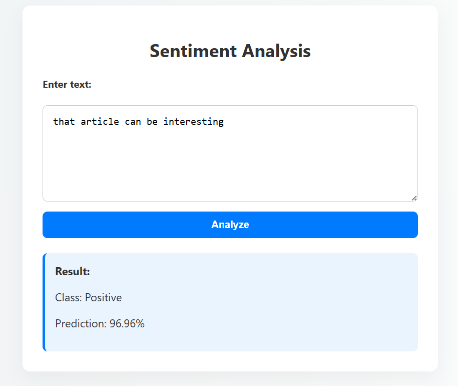

# Sentiment Analysis Model

This is a sentiment classification model built using TensorFlow/Keras for multiclass text analysis (Negative, Neutral, Positive).  
It includes preprocessing logic and is ready to be used for inference or further fine-tuning.

## Overview
| <!-- -->|<!-- -->|
|----------------------|------------------------------------|
| **Task**           | Sentiment Analysis          |
| **Model Type**    | CNN  |
| **Classes**           | Negative (0), Neutral (1), Positive (2) |
| **Framework**        | TensorFlow / Keras                 |
| **Accuracy**   | ~0.84                              |

- **Use Case**: Reviews, social media monitoring, business analytics, chatbots
- **Language**: English

---

## Project Structure

| File | Description |
|------|-------------|
| `model/sentiment_model.keras` | Saved Keras model trained for sentiment classification |
| `model/tokenizer.pkl` | Pickled Tokenizer instance used to encode input texts |
| `model/load.py` | Python script with functions to load the model and tokenizer, and predict sentiment |
|`app.py`| Simple web application using Flask to expose sentiment prediction via REST API|
|`static/style.css` and `templates/index.html`| UI
| `README.md` | This documentation file |

## UI
 